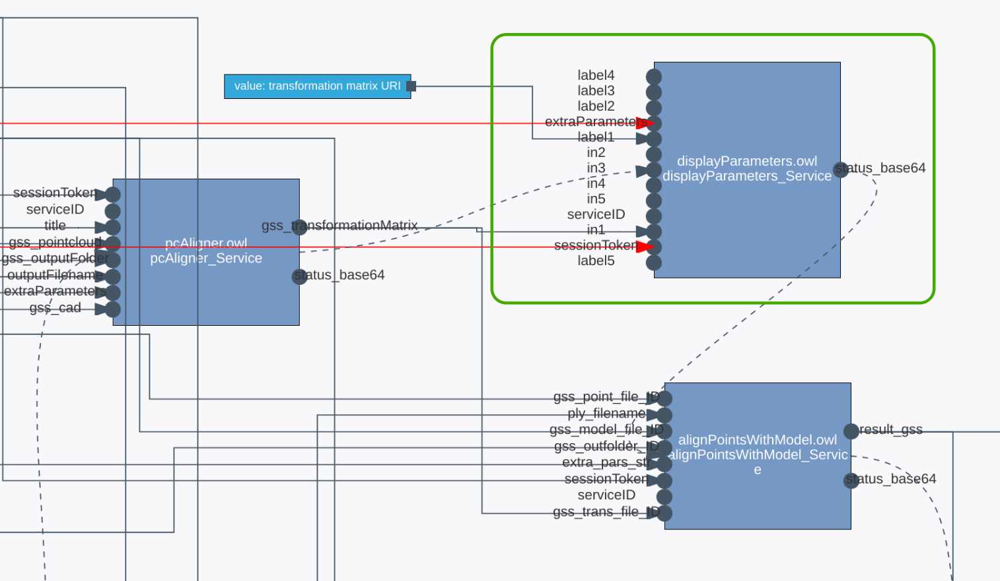
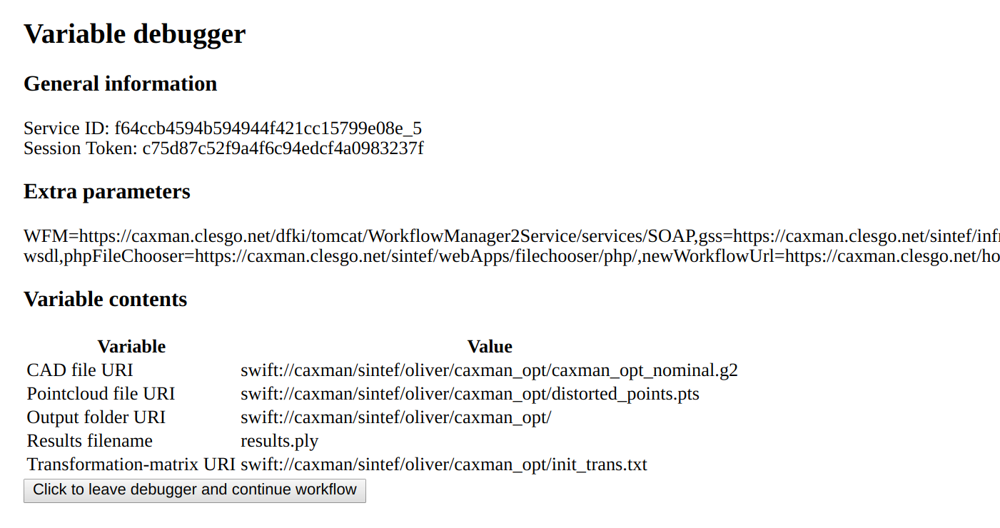

Python-based CloudFlow application for workflow debugging
=========================================================
This CloudFlow application offers tools for debugging workflows.

## `parameterDebugger` service
This application is registered under the following URI:
```
http://core/apps/parameterDebugger.owl#parameterDebugger_Service
```
This application pauses the workflow and offers to display any output
parameters created so far.

The following picture shows the service integrated in a bigger workflow. The
`gss_transformationMatrix` output parameter of the previous workflow step is
routed to one of the service's inputs, and a corresponding label is set.
<p align="center">
  
</p>

Upon execution, the service will pause the workflow and display a debug page
similar to the following one:
<p align="center">
  
</p>

### Service parameters
| Parameter name | Wiring required? | Description |
| -------------- | --------- | ----------- |
| `sessionToken` | yes | The session token used for authentication. Should be connected to the workflow input with the same name |
| `serviceID` | no | Provided automatically by the WFM, must be left open. |
| `extraParameters` | yes | Contains parameters such as the GSS location, must be wired to corresponding workflow input. |
| `in1` - `in5` | no | Arbitrary parameter to be displayed |
| `label1` - `label5`| no | Optional label for `in#` parameter, defaults to `"in#"` |

## Development information
### Prerequisites
To build, run, and test this skeleton service, you only need to have Docker
installed on your machine. All required software is already bundled in Docker
containers.

For further development based on this skeleton, it is highly recommended to
use a local Python environment.

### Configure, build, and run the service
#### Configuration
Prior to running the service, have a look at the file `env`. This file defines
environment variables which will be passed into the container. The first one,
`CONTEXT_ROOT`, defines the deployment path of the app relative to root.
Essentially, this needs to be set to the relative path under which the VM
hosting the service is reachable.

You can define further configuration variables which then can be used in the
application source code.

#### Build and run
To compile service source code, pack it into a Docker container, and run the
container, run
```
./rebuildandrun.sh
```
The service will listen on port 80 of your machine

On the first run, this might take a while since the base container images need
to be downloaded and dependencies need to be installed. Subsequent builds will
complete significantly faster.

This run script starts the container in daemon mode, meaning that the command
returns immediately and that logs are not immediately visible.

Alternatively, run the container interactively via:
```
docker run -p 80:80 --env-file=env app-debugger
```
Again, choose a fitting port number.

#### Testing the service
Once the container is running, it can be tested by using its published wsdl
file to create a SOAP webclient and call methods with it.

This example includes a Python-based client application, found in the
`test_client/` folder. If you have a local Python 3.x environment, you can
simply run `python test_debugger.py` (make sure that all dependencies defined in
`requirements.txt`) are installed. Alternatively, the example includes a Python
Docker container for executing the test client.

To use the Python container, run
```
cd test_client
./build.sh      # run this only once
./run.sh        # run this every time you want to test
```

The test client saves the application output to `test.html`, which you can 
review with your browser. Note that the button on this test page won't work,
since the application has not been started from within a running workflow.

Note also that you need to enter your username, project, and password for each
test run to create a valid session token.

You can make changes to `test_debugger.py` to test other methods or other
deployment locations. Rebuilding the container is not necessary after such
changes.
