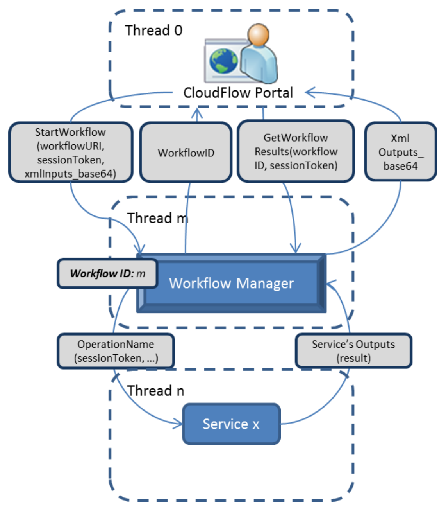
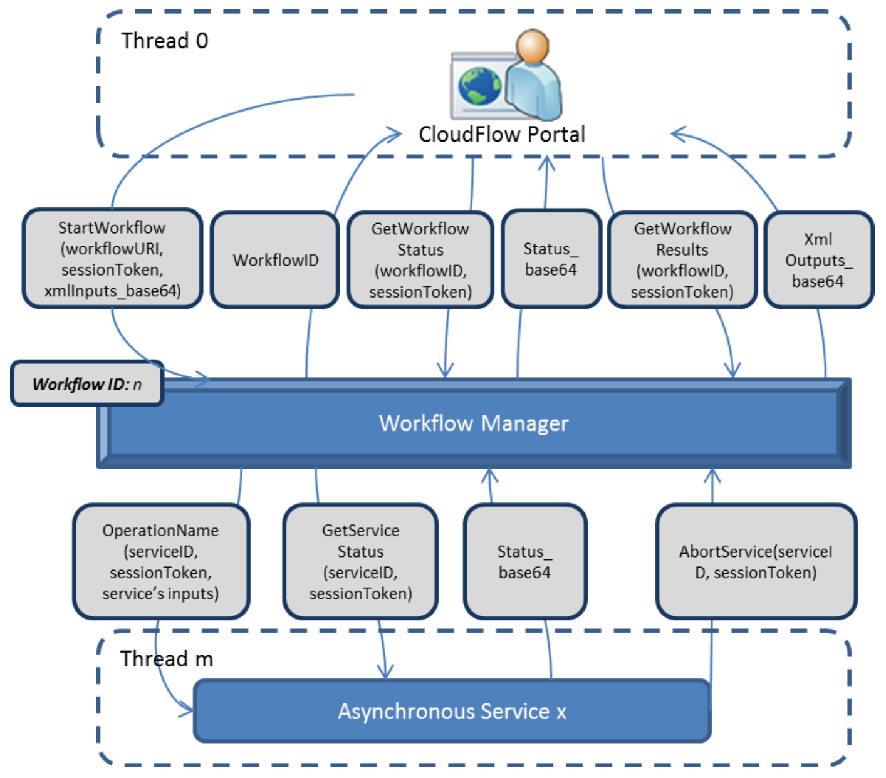
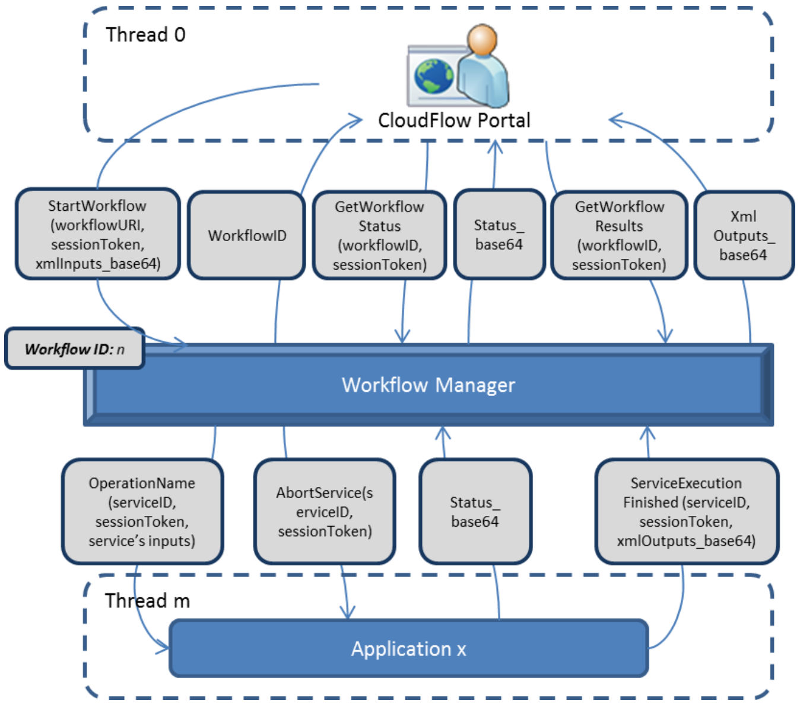

# Service types in the SemWES platform
The SemWES platform currently knows three types of SemWES services. It is
important to understand the differences between those types in order to choose
the right type for a certain use case.

_Important:_ In this document, "service" generally refers to a SemWES
service rather than a webservice. A single webservice application may contain
several webmethods which can be used as different types of SemWES
services.

_Note:_ All SemWES services are [SOAP services](https://en.wikipedia.org/wiki/SOAP),
meaning that they must expose their functionality via SOAP webmethods.

## TLDR (Too Long, Didn't Read)
For the impatient, here are a few general rules of thumb for choosing the right
type of service to develop.

* Make a **synchronous service** only when you can _guarantee_ that it will
  _always_ execute in a time of under 10 seconds.
  
  Do _not_ make a synchronous service if it requires file input or will need to
  do any network communication with other services.
  
  Do _not_ make a synchronous service if you want user interaction or show
  status reports to the user while the service is running.

* Make an **asynchronous service** or **application** when you cannot guarantee
  a short execution time (< 10 seconds). Make an asynchronous service or
  application when you need file input or output or any network communication
  during execution.

  * Make an **asynchronous service** if you want to have status reports
    delivered to the user during execution. These reports can be simple text or
    complex html pages.

    Do _not_ make an asynchronous service if you require user interaction
    during service execution.

  * Make an **application** if you want the user to _interact_ with your service
    during its execution.

* If you want to use **HPC resources**, head over to the documentation dedicated
  to that topic: [Using HPC resources](../README.md#using-hpc-resources)

Curious what distinguishes the three service types from each other and why the
rules above are as they are? Read on.

## Synchronous services
Synchronous services are the simplest types of SemWES services. They are
wrappers of single SOAP webservice methods which, when called, do something, and
then immediately return their results. They do not require any pre-defined
input or out values.

_Important:_ A synchronous service has to return its response within the HTTP
request timeout time. If it fails to do so, it is automatically terminated by
the workflow manager. This response time is not strictly defined but ranges
typically around 10 to 30 seconds, so synchronous services fit only for simple
tasks. They can be compared to simple command-line commands which take some
input and immediately return some output.

_Hint:_ If your service needs to upload and/or download files via GSS, it most
likely should _not_ be a synchronous service since file upload and download time
depends heavily on file size and the current network speed.

Below you see the execution schema of a synchronous service and its interplay
with the workflow manager during a workflow execution.
<p align="center">
  
</p>

### Implementation specification
Synchronous services are single SOAP webmethods with arbitrary names. 

##### Inputs
The inputs depend mainly on the implementation of the service itself. For 
example, a file-converter service would receive an input file location as an
input parameter. However, some optional parameters might be helpful, for example
if your service needs access to the session token, its unique execution ID, or
the extra parameters.

The `extraParameters` provide the addresses of some platform components,
 for example, the path to the Workflow Manager's SOAP interface.

| Parameter | Required? | Type | Description |
| --------- | --------- | ---- | ----------- |
| `sessionToken` | no | string | The current session token (supplied by the workflow manager), can identify users and their permissions. |
| `serviceID` | no | The ID assigned to this service by the executione engine, provided automatically |
| `extraParameters` | no | Needs to be connected to the "extraParameters" workflow input |
| more inputs | no | any | Any other inputs required for this specific method |

##### Outputs
Any outputs required for this specific method. (There are no mandatory outputs.)

## Asynchronous services
Asynchronous services are meant for operations which possibly take longer to
complete than the HTTP request timeout time. These are especially operations
which have file input or output, need to interact with other services over the
network or in general have completion times which depend significantly on their
specific input values. Examples are file converters, meshers, solvers, etc.

Asynchronous services are regularly queried by the workflow manager for their
current status. Via these queries, they can report their status in the form
of an html page which will be displayed to the user executing the workflow.
These pages can also include images, but they do not allow user interaction.

Below you see the execution schema of a synchronous service and its interplay
with the workflow manager during a workflow execution.
<p align="center">
  
</p>

### Implementation specification
An asynchronous service has to provide two vital methods: One with an arbitrary
name to start the service and one called `getServiceStatus`, is used to
continuously query your service for its current execution status.

*Important:* For technical reasons, both these methods must have exactly the
same output parameters.

Additionally, an asynchronous service may implement the `abortService` method,
to enable the Workflow Manager to gracefully stop your service, as well as the
`notifyService` method, which can be used to send a message to this service, if,
for example, you'd like to signal an event during the execution of this service.

#### Service startup method (mandatory)
This is the method used to start the service. It can have an arbitrary name.

##### Inputs
| Parameter | Required? | Type | Description |
| --------- | --------- | ---- | ----------- |
| `serviceID` | yes | string | Unique service-execution ID given by the workflow manager.|
| `sessionToken` | yes | string | The current session token (supplied by the workflow manager), can identify users and their permissions. |
| more inputs | no | any | Any other inputs required for this specific service |

##### Outputs
| Parameter | Required? | Type | Description |
| --------- | --------- | ---- | ----------- |
| `status_base64`| yes | string | Base64-encoded string holding the current status of the service. May be simple text or HTML which serves as the "GUI" of the service. |
| more outputs | no | any | Any further outputs required for this specific method |

Note that the further outputs are only part of this startup method to define the
full "signature" of the service. It lies in the nature of an asynchronous 
service that the actual values of these outputs cannot be known when this method
returns. Instead, they are set to dummy values (for example "UNSET"). The final
values will be retrieved by the `getServiceStatus` method.

#### Method `getServiceStatus` (mandatory)
This method is called periodically (currently every 6 seconds) by the workflow
manager to query the current status of the service. If the service finishes its
execution, the last call to `getServiceStatus` will also set the final values of
any additional output parameter beside `status_base64` which has been defined in
the service's startup method.

##### Inputs
| Parameter | Required? | Type | Description |
| --------- | --------- | ---- | ----------- |
| `serviceID` | yes | string | Unique service-execution ID given by the workflow manager.|
| `sessionToken` | yes | string | The current session token (supplied by the workflow manager), can identify users and their permissions. |

##### Outputs
| Parameter | Required? | Type | Description |
| --------- | --------- | ---- | ----------- |
| `status_base64`| yes | string | Base64-encoded string holding the current status of the service. May be simple text or HTML which serves as the "GUI" of the service. |
| more outputs | no | any | Must be the same outputs as defined in the service's startup method |

Note that `status_base64` must have one of the following values:
* Any base64-encoded string: Contains any text, html, or even embedded 
  JavaScript code which will be displayed in the portal.
* `"UNCHANGED"` (_not_ base64-encoded): Indicates that the service did not
  change its status since the last call to this function.
* `"COMPLETED"` (_not_ base64-encoded): Indicates that the service has completed
  its execution. The workflow manager will collect the values of the further
  return arguments and move on to the next step in the workflow.

The above set of choices implies that all return values except `status_base64`
only need to be set to meaningful values if the reported state is `"COMPLETED"`.
Otherwise, they can be set to dummy values (after all, they are not known yet if
the service is not finished) just as in the startup method.

#### Method `abortService` (optional)
This optional method will be invoked by the workflow manager when a user cancels
a running workflow. It is meant to ensure that running services exit gracefully,
free resources they are using, or make sure that long-running calculations are
stopped when required.

##### Inputs
| Parameter | Required? | Type | Description |
| --------- | --------- | ---- | ----------- |
| `serviceID` | yes | string | Unique service-execution ID given by the workflow manager.|
| `sessionToken` | yes | string | The current session token (supplied by the workflow manager), can identify users and their permissions. |

##### Outputs
| Parameter | Required? | Type | Description |
| --------- | --------- | ---- | ----------- |
| `success`| yes | bool | `True` if the service aborted successfully |


#### Method `notifyService` (optional)
If provided, this method can be used to pass a message to a running instance
of the service.

##### Inputs
| Parameter | Required? | Type | Description |
| --------- | --------- | ---- | ----------- |
| `sessionToken` | yes | string | The current session token (supplied by the workflow manager), can identify users and their permissions. |
| `serviceID` | yes | string | Unique service-execution ID given by the workflow manager. |
| `message` | yes | string | The message that is passed to the service. |

##### Outputs
| Parameter | Required? | Type | Description |
| --------- | --------- | ---- | ----------- |
| `response`| yes | string | The service's response to the received message |

## Applications
Applications are very similar to asynchronous services, but with a slightly
different scope. While an asynchronous service, once started, runs without any
further user input (it only shows output to the user regularly), applications
are designed to interact with the user while they are being executed. Instead
of being queried for their status by the workflow manager, they have to
actively report to the workflow manager once their execution is finished.

Below you see the execution schema of a synchronous service and its interplay
with the workflow manager during a workflow execution.
<p align="center">
  
</p>

### Implementation specification

#### Service startup method (mandatory)
This is the method used to start the application. It can have an arbitrary name.

##### Inputs
| Parameter | Required? | Type | Description |
| --------- | --------- | ---- | ----------- |
| `serviceID` | yes | string | Unique service-execution ID given by the workflow manager.|
| `sessionToken` | yes | string | The current session token (supplied by the workflow manager), can identify users and their permissions. |
| more inputs | no | any | Any other inputs required for this specific application |

##### Outputs
| Parameter | Required? | Type | Description |
| --------- | --------- | ---- | ----------- |
| `status_base64`| yes | string | Base64-encoded string holding the current status of the service. Must contain HTML code which serves as the "GUI" of the application. |
| more outputs | no | any | Any further outputs required for this specific method |

Note that just like for asynchronous services, the further outputs are only part
of this startup method to define the full "signature" of the service. As the
actual values of these outputs cannot be known when this method returns, they
can be set to dummy values (for example "UNSET"). The final values have to be
actively posted to the workflow manager.

#### Method `abortService` (optional)
See `abortService` description for asynchronous services.

### How to finish an application's execution and return results
Applications run uninterrupted by the workflow manager until they actively
report that they are finished. Specifically, an application must make a SOAP
call to the workflow manager's `serviceExecutionFinished` method. This method
expects as input arguments the application's `serviceID`, the `sessionToken`,
and `xmlOutputs_base64` which contains a base64-encoded representation of the
application's output parameters as defined in its startup method. The 
non-encoded version of this parameter needs to have the following xml format:
```xml
<ServiceOutputs>
  <output_parameter_1>output value</output_parameter_1>
  <output_parameter_2>output value</output_parameter_2>
  ...
</ServiceOutputs>
```
Here, `output_parameter_#` must match the names of the further output values
defined by the application's startup method.

### A note on application design
Generally, a SemWES application can come in two flavours:
1. The complete application is a single HTML page (with embedded JavaScript) and
   is delivered as a whole in the `status_base64` return argument of the 
   application's startup method. Then, obviously, all the application's logic
   must be contained in this single HTML page.
2. If the application itself is too complex or implemented in a way which
   prevents it from being delivered in a single HTML page, it can be hosted
   somewhere and included into the HTML page delivered in `status_base64` inside
   an iframe.

   _Important:_ If the application is embedded via an iframe, care has to be 
   taken when it comes to communication with the workflow manager (i.e., calling
   its `serviceExecutionFinished` method). A JavaScript method which calls the
   workflow manager from within the embedded HTML page will _not_ be allowed.
   Since it would originate from a different domain (the workflow manager is
   hosted on a different domain than all non-platform services), it would be
   blocked by the browser as being a cross-domain request. There are two ways
   around this issue:
   1. Include the logic that calls the workflow manager directly into the HTML
      delivered in `status_base64` of the startup method. (This HTML is shown by
      the workflow manager itself and will thus _not_ be subject to cross-domain
      restrictions.) Make the embedded HTML page communicate with its parent
      using the HTML5 postMessage protocol to propagate its results and trigger
      the call to the workflow manager.
   2. The cross-domain blocking happens only for requests originating in a
      browser (it's the browser itself which blocks such requests). Thus, the 
      embedded HTML page can make a request to its hosting server and this
      server can then call the workflow manager.
