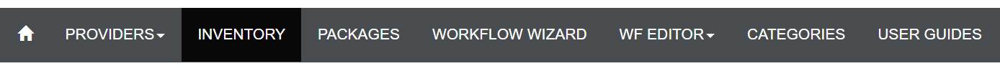
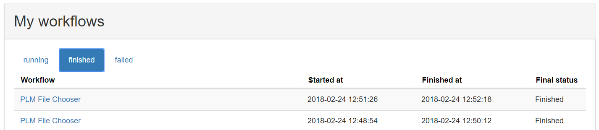

# Level 1 - Overview over the portal GUI

In this tutorial we will get to know the GUI, start a workflow and inspect its results.

## Step 1 - Navigation
For the hands-on session the relevant subpages are __Inventory__ and __WF Editor__ -> __Workflow editor__, which can be found via the navigation bar.

### __Inventory__

- Lists information about currently running, finished, or failed workflows.
- Shows all available workflows, by categories.

### __WF Editor__ -> __Workflow editor__

- Provides functionality to create and edit workflows, to add new services to the portal, and to delete services and workflows from the portal.
- Will be utilized in Levels 2 and 3.

## Step 2 - Inspecting available workflows
1. Select __Inventory__ in the navigation bar, which will lead you to the following view:

2. In the lower half of the page you can see a list of available workflows.
3. When hovering with the pointer over a workflow, you can see additional information about it (logical URI, Category).

## Step 3 - Executing a workflow
1. In the list of available workflows, click on __PLM web client__ to execute this workflow.
2. Click on __Run workflow__ to start the execution

3. A new page will open showing the status of this workflow, while it is starting.
4. When the workflow is loaded completely, you will see the interface of the PLM web client.

## Step 4 - Inspecting a running worklow
1. Go back to the previous page, where the __Inventory__ should still be visible.
2. In the upper half of the page you can see the running __PLM web client__ workflow.

- Hint: To abort a running workflow you could click the cross at the end of the workflow's entry.

## Step 5 - Inspecting finished workflows
1. To finalize the __PLM web client__ workflow, click on __Done__ in its designated tab in the upper right corner, leading you to the __Result page__ of this workflow.

2. Close this tab and go back to the __Inventory__.
3. Under __My workflows__, click at __finished__, were you can see the recently finished workflow.

4. If you click on the Workflow's name you will be redirected to the result page, where you can inspect the results of your workflow again.

## Conclusion
Congratulations, you have finished the first tutorial. You should now be able to start workflows and examine their status and result