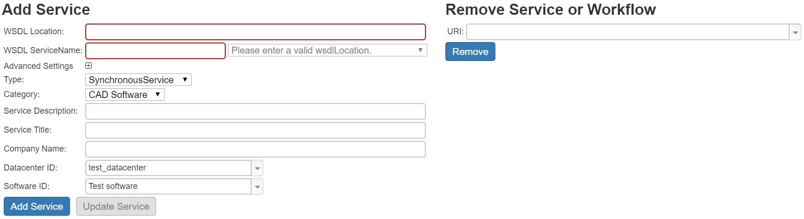
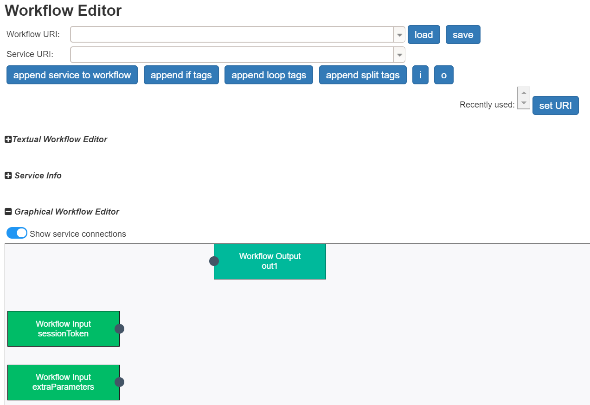
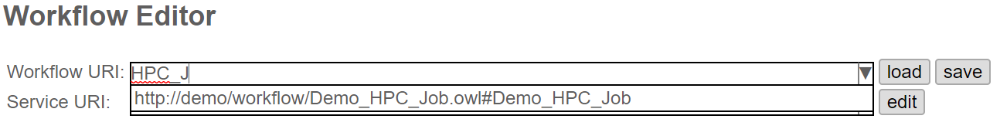
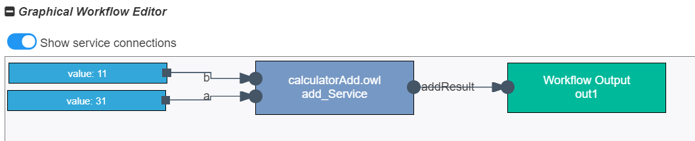
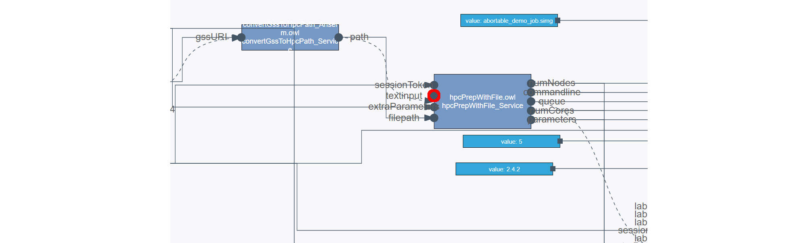
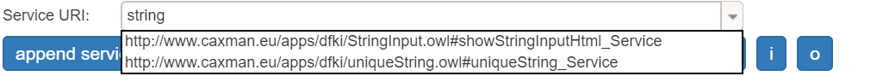
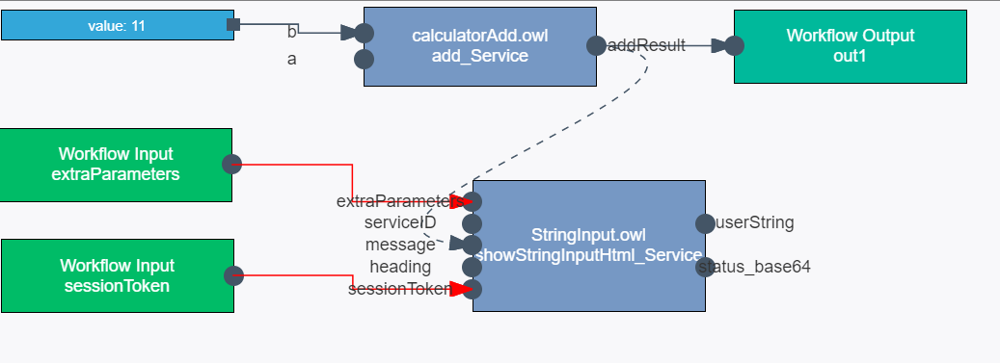
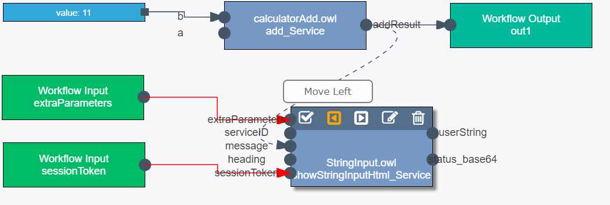
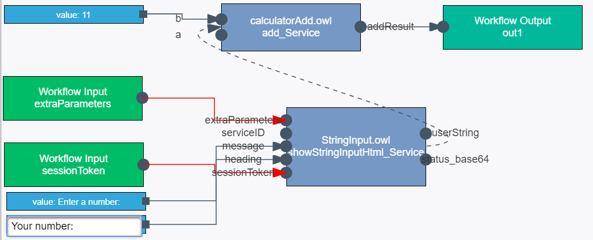
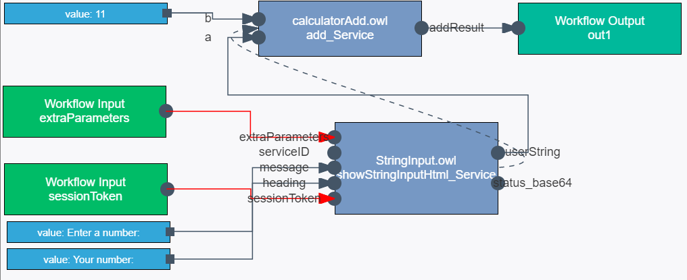

# Tutorial: Editing workflows
In this part of the tutorial we will load a workflow, edit it, and finally save it, whereby learning the basics of the Workflow Editor.

1. To start, navigate to the __Workflow editor__.

- The upper part of the page provides the means to add services, and to remove services and workflows.

- The lower parts feature the tools to load, edit and save workflows.
2.  Scroll down until the whole lower section is visible.

## The Workflow Editor
The Workflow Editor provides means to create sophisticated workflows:

 - The textual editor can be used to fine-tune the workflow and create more complex arrangements of services. There should be no need to consult the textual editor during the course of this tutorial, the interested users might nevertheless have a peek at the textual representation of their workflow.
 - The graphical editor provides an intuitive interface to arrange, connect and edit services.
 
## Step 1 - Load workflow

1. To load a workflow, select one from the dropdown-menu __Workflow URI__, or type the name of the desired workflow.

2. For the sake of this tutorial, please select the following workflow:

> http://demo/workflow/Demo_HPC_Job.owl#Demo_HPC_Job

3. Click on __load__ and confirm your choice.
4. Shortly afterwards, the workflow should be visible in the graphical editor. The dark blue boxes represent __services__, the green boxes __workflow inputs__ and __outputs__, and the light blue boxes represent __static input parameters__. This is a rather advanced HPC workflow, featuring (from right to left) the service to launch the HPC job (`hpcLaunch-4-Anselm.owl`), a parameter debugger to print the provided parameters during execution, an HPC preparation service (parsing a file to generate the correct inputs for the HPC Launch service), a converter service (converting a GSS URI to a path valid on the HPC), and at the very left a fileChooser service, showing a GUI to the user to select a file from GSS.

## Step 2 - Edit workflow
Now, we will modify the workflow  by adding a new service to replace one of the static values with an input dialog.

1. Click on one of the input node __textInput__ of the __hpcPrepWithFile__-service (in the middle) to remove the attached value. You can re-add it anytime, by clicking on the input again, and then on the value node to re-enter a value.

2. Select the following service from the __Service URI__ dropdown-menu:

> http://DFKI/apps/showStringInputHtml.owl#showStringInputHtml_Service

3. Click on  __append service to workflow__. Shortly afterwards the new service should appear in the graphical editor. The dotted line indicates the order of the services in your workflow. Right now, the __StringInput__ is scheduled to be the very last service in the workflow.

 To change the order, double-click on the newly added service and use the buttons with the arrows to modify its position within the workflow. Now, please move the __showStringInputHtml__-service right in front of the __hpcPrepWithFile__-service.

4. The workflow is still far from complete, you may provide the inputs __message__ and __heading__  by clicking on their input node at the __showStringInputHtml__-service. To change their values, click on the respective nodes (light blue boxes). Both, the heading and the message will be displayed to inform the user what kind of value should be entered.

5. Finally, it remains to connect the output of the newly added service to the empty input of the __hpcPrepWithFile__-Service. Click on the __userString__-output and drag a connection to the empty __textInput__ node. The __Workflow Input__  __extraParameters__ and __sessionToken__ were automatically connected to the __showStringInputHtml__-service and should remain in that state.

## Step 3 - Save workflow
1. To save the workflow, adapt its __Workflow URI__ to your liking. Do not leave it unchanged, as you will then overwrite the original workflow. The part behind the # will define the name of your workflow. It must not start with a digit, but may contain underscores (_). The part in front of the # defines the unique identifier of your workflow.

2. Once the __Workflow URI__ has been adapted, click on __save__ and confirm your choice.
3. Please wait patiently until a success message appears.

## Conclusion
In this tutorial you have had a look at the Workflow Editor. You have loaded an existing workflow, adapted it to your needs and saved it under a different identifier.