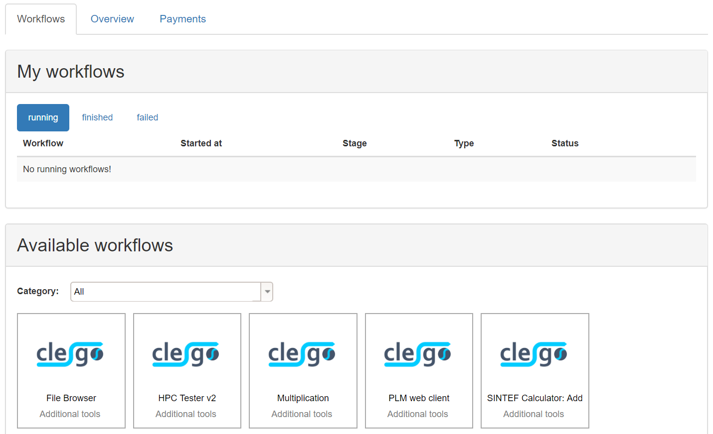
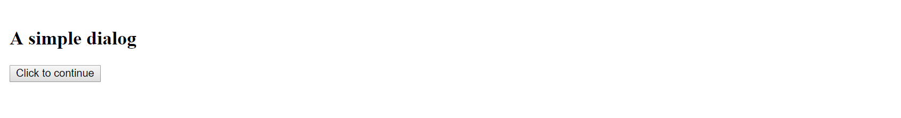
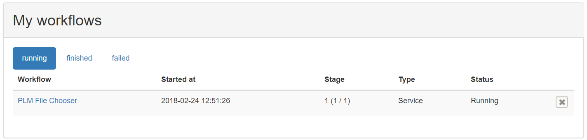
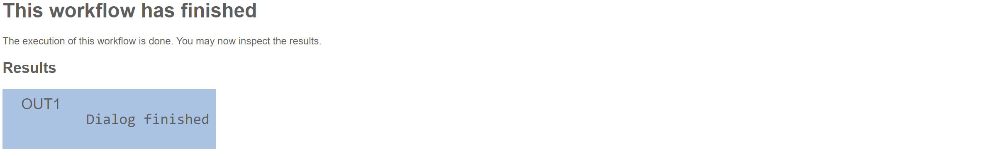

# Tutorial: Overview over the portal GUI

In this tutorial we will get to know the GUI, start a workflow and inspect its results.

## Step 1 - Navigation

The navigation bar provides fast access to the different pages of the portal.

__Workflows__
- The tabs __Available workflows__, __Running workflows__ and __Finished workflows__ lead to overviews of the respective kind of workflows.

__Workflow Editor__
- The Workflow Editor provides functionality to create and edit workflows, to add new services to the portal, and to delete services and workflows from the portal.
- It will be utilized in the tutorials [Basic workflow editing](tutorials/workflows/basics_editing.md) and [Registration of new services](tutorials/workflows/basics_service_registration.md).

__Log out__
 - Using this button, the current user can be logged out and the browser will be redirected to the login.

## Step 2 - Inspecting available workflows
1. Select __Available workflows__ in the navigation bar, which will lead you to the following view, listing all available workflows:

2. Here, you can see a list of available workflows.

## Step 3 - Executing a workflow
1. In the list of available workflows, click on __Demo\_Dialog__ to execute this workflow.
2. A new page will open, showing the status of this workflow, while it is starting:

3. When the workflow is loaded completely, you will see a simple dialog:

## Step 4 - Inspecting a running worklow
1. Close the current page and select __Runnining workflows__ to show the list of running workflows for the current user.

2. To reopen the workflow's page click on its entry.
- Hint: To abort a running workflow, you could hover over an workflow entry and click the cross at the end of the entry.

## Step 5 - Inspecting finished workflows
1.  To finalize the __Demo\_dialog__ workflow, click on __Click to continue__ in its designated tab, leading you to the __Result page__ of this workflow.

2. Close this tab and head over __Finished workflows__ in the previous windows, where you can see all your finished workflows.

1. If you click on the workflow's entry you will be redirected to the result page, where you can inspect the results of your workflow again.

## Conclusion
Congratulations, you have finished the first tutorial. You should now be able to start workflows and examine their status and result