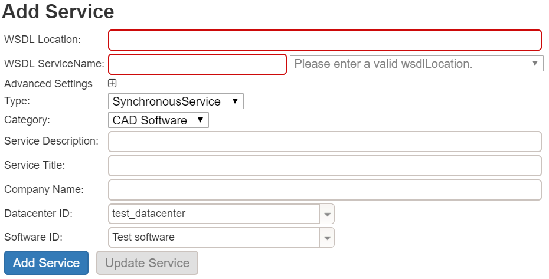
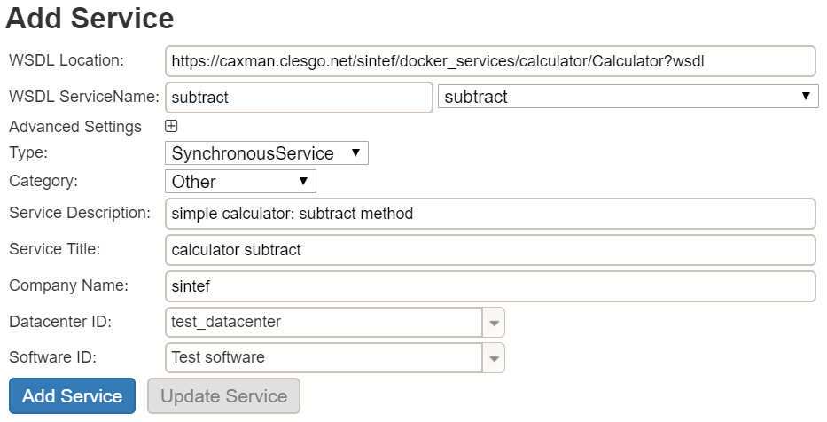
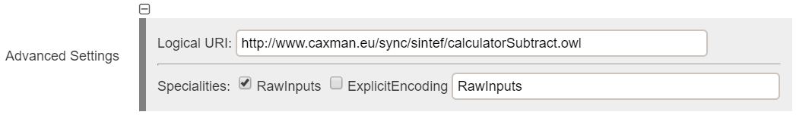

# Tutorial: Service registration
This tutorial shows you how to register a new service in the SemWES platform.

1. Navigate to the Workflow Editor.

2. The dialog to add new services is located at the top of the page.

3. The first and most important thing to provide is the __WSDL Location__ of the new service. For this tutorial, you could add the service created in the deployment tutorial (https://github.com/SemWES/docs-and-training/blob/master/tutorials/workflows/basics_service_deployment.md) :

> https://srv.hetcomp.org/demo-my-test-service1/my-demo?wsdl

You could also just re-add one of the existing services (remember to adapt the logical URI later):
> https://api.hetcomp.org/dfki/CFUtilities/services/CFUtilities?wsdl

4. Once the WSDL has been loaded, select one of the service's methods from the dropdown-menu __WSDL ServiceName__, e.g. __showStringInputHtml__.
5. As __Type__ select __Application__, and as __Category__ select __Other__.
6. You can also enter a __Service Description__ and a __Service Title__ which will be shown during the execution of the service.
7. The __Company Name__ can right now be anything you prefer, it will be reflected in the logical URI of the service.
8. __Datacenter ID__  and __Software ID__ can remain unchanged.

9. To provide a unique __Logical URI__ for your service, click on the plus symbol behind __Advanced Settings__. Here you can change the URI under which the service will be saved. It should be of the format: https://any/path/you/pefer.owl
10. The other advanced settings should to remain unchanged.

11. After you have adapted all settings and provided the necessary information click on __Add Service__ to save the service.
12. Please wait patiently until a success message appears.

- Hint: It is necessary to re-load the page such that the newly added service appears in the dropdown-menu of the Workflow Editor.

## Conclusion
In this tutorial you have learned how to register new SOAP-Services with the SemWES platform.
