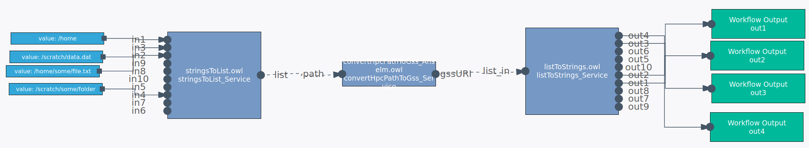

# Converting from GSS URIs to HPC-cluster file paths and back
When services on the SemWES platform exchange files and folders, they do that
not by transferring data back and forth between web services. Instead, they
transfer only URIs which are understood by the Generic Storage Service GSS, and
GSS is utilized when interaction with the actual data becomes necessary.

On an HPC cluster, however, GSS URIs don't mean anything. Also, since the 
available storage in CloudiFacturing is this very HPC cluster's storage, taking
detours through GSS makes no sense. At the interface between SemWES services
(which handle GSS URIs) and HPC jobs (which handle absolute cluster file paths),
a conversion between the two concepts needs to be made. To do so, converter 
services are available for each HPC cluster.

## Usage
Use the workflow editor to include the services into your pre- and
post-processing steps of your HPC workflows. 

## Converters for the Anselm cluster
### GSS URI &rarr; cluster path
* Service URI: http://sintef/sync/convertGssToHpcPath_Anselm.owl#convertGssToHpcPath_Service
* Input arguments: `gssURI` (a valid Anselm GSS URI)
* Output arguments: `path` (corresponding Anselm path)

### cluster path &rarr; GSS URI
* Service URI: http://sintef/sync/convertHpcPathToGss_Anselm.owl#convertHpcPathToGss_Service
* Input arguments: `path` (absolute (starting with `/`) Anselm path)
* Output arguments: `gssURI` (corresponding GSS URI)

## Converters for the Salomon cluster
The same services are available for the Salomon cluster. Use the following
service URIs:
* GSS URI &rarr; cluster path: http://sintef/sync/convertGssToHpcPath_Salomon.owl#convertGssToHpcPath_Service
* cluster path &rarr; GSS URI: http://sintef/sync/convertHpcPathToGss_Salomon.owl#convertHpcPathToGss_Service

## Conversion of lists of URIs or paths
Calling the conversion services repeatedly for several GSS URIs or HPC paths
can quickly become cumbersome and also slow when the workflow is executed. The
conversion services therefore also work on json-formatted lists of strings
where each string is either a GSS URI or an HPC path.

Example of a single GSS URI as input to a conversion service:
```
'it4i_anselm://'
```

Example of a list of GSS URIs as input to a conversion service:
```
'["it4i_anselm://", "it4i_anselm://home/", "it4i_anselm://home/file.dat"]'
```

To facilitate creation of these lists, two auxiliary services exist:

### `stringsToList`
This service takes up to 10 individual string arguments and merges them into
a json-formatted list.
* Service URI: http://sintef/sync/stringsToList.owl#stringsToList_Service

### `listToStrings`
This service takes a json-formatted list of strings and extracts up to 10
individual strings from it.
* Service URI: http://sintef/sync/listToStrings.owl#listToStrings_Service

The following picture shows an example workflow where 4 GSS URIs are merged
into a list, converted to HPC paths, and converted back to 4 individual
strings.
<p align="center">
  
</p>
