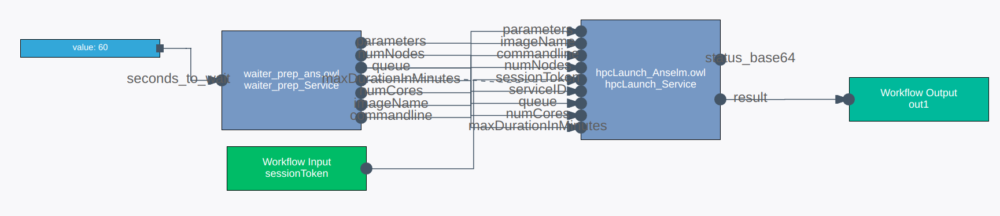

# HPC pre- and post-processing services
The [generic HPC service](HPC_service.md) requires a number of input parameters
such as number of nodes and CPUs, queue, and a commandline with its parameters.
Especially since some of those parameters are dependent on the specific input
(user-selected file names may change, but also simulation parameters might be
dependent on file size etc.), hard-coding these parameters is rarely an option.

Also, an HPC job's output is limited to a single string parameter (the `result`
output argument of the generic HPC service), whereas the actual result might be
binary files, several files, or other more complex elements.

Therefore, simple pre- and post-processing services will usually be required
alongside a Singularity image. This section describes their use and concepts.

## Pre-processing services
A pre-processing service, in its simplest form, takes a number of input file
paths or parameters as input arguments and outputs all parameters that the
generic HPC service expects as input. It is usually a simple synchronous
service. This service can then be used in the workflow editor to remove any
hard-coded input parameters, such as depicted in the next image:

  

Head over to the code examples for a documented [sample HPC preprocessor](../code_examples/Python/sync_HPC_preprocessor/) to download and adapt.

Note that a workflow often starts with the selection of some input files,
which result in SemWES GSS URIs and _not_ in file paths which can be
understood in the HPC environment. You should therefore use corresponding
[converter services](HPC_gss_conversion.md) which convert these GSS URIs to 
file paths, which will in return be the _input_ for the pre-processing service.

## Post-processing services
A post-processing service takes the HPC job's result string (i.e., the HPC
service's `output` argument) and converts it to some format which can be further
processed on the SemWES platform.

Examples:
* If the output is a single value or number which can be understood "as is" by
  other services, you don't need a post-processing service.
* If the output is a single file path, use a [converter](HPC_gss_conversion.md)
  as post-processing service to convert it to a GSS URI.
* If the output is a combination of several file paths, write a simple
  asynchronous post-processing service which has one output argument per file
  path. Then, use [converters](HPC_gss_conversion.md) to convert all of these
  file paths to GSS URIs.
* If the output needs to be interpreted or further processed in any way (think
  of the creation of images or graphs), write an _asynchronous_ post-processing
  service with outputs that can be used further on the platform.
