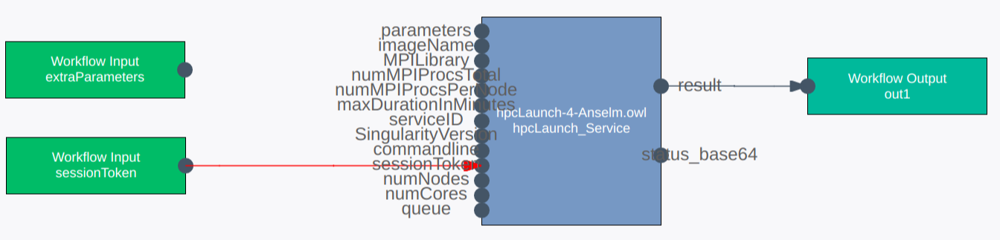

# Overview over the generic HPC service
This document gives an overview over the SemWES HPC service and describes how
to use it to execute Singularity images on an HPC cluster. Please note that this
article refers to version 4 of the HPC service, introduced on Oct. 16th 2018.
The previous documentation is still available as [legacy
documentation](./HPC_service_old.md).

_Note:_ You might want to read the [instructions on how to create and register
Singularity images](../service_implementation/basics_singularity.md) first.

## Integrating the generic HPC service in a workflow
There is a separate instance of the HPC service deployed for each of the
available HPC clusters. Use the following URIs in the workflow editors to add
one of them to your workflow:
* Anselm cluster: `http://www.cloudifacturing.eu/async/sintef/hpcLaunch-4-Anselm.owl#hpcLaunch_Service`
* Salomon cluster: `http://www.cloudifacturing.eu/async/sintef/hpcLaunch-4-Salomon.owl#hpcLaunch_Service`

The following screenshot shows the service inside the workflow editor:
<p align="center">
  
</p>

### Input parameters
The complete set of input parameters is explained in the following table:

| Parameter name | Wiring required? | Description |
| -------------- | --------- | ----------- |
| `sessionToken` | yes | The session token used for authentication. Should be connected to the workflow input with the same name |
| `serviceID` | no | Provided automatically by the WFM, must be left open. |
| `imageName` | yes | Name of the Singularity image to execute. The image must have been registered before usage. |
| `commandline` | yes | The shell command to execute inside the Singularity image, without any parameters. |
| `parameters` | yes | The parameters to the command specified in `commandline`. |
| `queue` | yes | The cluster's queue to run the job on. See https://docs.it4i.cz/general/resources-allocation-policy/ for available queue names.|
| `numNodes` | yes | Number of nodes to reserve for the job. |
| `numCores` | no | Number of CPUs to reserve on each node. Note that each cluster-queue combination has a minimum and maximum value for this parameter. If not provided, a default value will be used. This depends on the queue and cluster, but will usually be such that entire nodes are reserved. |
| `maxDurationInMinutes` | yes | Maximum runtime after which a job will be aborted automatically. |
| `SingularityVersion` | no | Version of the Singularity module to load for execution. If not given, the lowest available version will be set automatically. See below for currently available versions on IT4I's clusters. Make sure to load a version compatible with your image version. Singularity is backward-compatible but not forward-compatible.) |
| `MPILibrary` | no | Module name of the MPI library to load for execution. See section on MPI jobs below for details. |
| `numMPIProcsPerNode` | no | Number of MPI processes to reserve per reserved node. See section on MPI jobs below for details. |
| `numMPIProcsTotal` | no | Total number of MPI processes to execute. See section on MPI jobs below for details. |

The above parameters are combined and passed as a job script to the queueing
software on the cluster. Note that the resulting job script and call command are
different depending on whether the MPI-related input parameters are specified or
not.

**Singularity versions on IT4I's cluster**
Currently available are:
* Anselm cluster: `3.5.2` (default value if none given)
* Salomon cluster: `3.5.2` (default value if none given)
* Salomon cluster with qdgx queue: `3.3.0`, `3.4.1`

**Example:**
If your Singularity execution call is `singularity exec my_image.simg python
/app/my_software.py inp.file -c 120`, the parameters should be:
* imageName: `my_image.simg`
* commandline: `python`
* parameters: `/app/my_software.py inp.file -c 120`

#### Non-MPI jobs
For non-MPI-enabled job executions, make sure to leave all three MPI-related
parameters (`MPILibrary`, `numMPIProcsPerNode`, and `numMPIProcsTotal`) empty.

The input parameters are then combined into the following job script:
```bash
#! /bin/bash
...
#PBS -q {queue}
#PBS -l select={numNodes}:ncpus={numCores}

ml Singularity/{SingularityVersion}
singularity exec \
    -H {home}:/home -B {scratch}:/scratch -B {service}:/service \
    {imageName} {commandline} {parameters} >> {logfile} 2>&1
```
The bindings for `/home`, `/scratch`, and `/service` are explained in the
article on [Singularity basics](../service_implementation/basics_singularity.md).

#### MPI jobs
For MPI-enabled jobs, all three MPI-related input parameters must be specified.
The following list shows selected MPI libraries available on IT4I's clusters.
For a list of _all_ currently available libraries, please contact IT4I directly.

Please note that according to [Singularity's documentation](http://singularity.lbl.gov/docs-hpc), OpenMPI version 2.1.0 should be used for
proper MPI support.

_Anselm cluster:_
* `OpenMPI/1.10.7-GCC-6.3.0-2.27`
* `OpenMPI/2.1.0-GCC-6.3.0-2.27`
* `OpenMPI/2.1.1-GCC-6.3.0-2.27` (recommended)
* `MPICH/3.2.1-GCC-6.3.0-2.27`
* `impi/2018.3.222-iccifort-2018.3.222-GCC-8.1.0-2.30`
* `mvapich2/1.9-icc`

_Salomon cluster:_
* `OpenMPI/1.10.7-GCC-7.1.0-2.28`
* `OpenMPI/2.1.0-GCC-6.3.0-2.27`
* `MPICH/3.2.1-GCC-6.3.0-2.27`
* `MPI_NET/1.2.0-intel-2016.01`
* `MVAPICH2/2.1-iccifort-2015.3.187-GNU-5.1.0-2.25`
* `impi/2018.3.222-iccifort-2018.3.222-GCC-8.1.0-2.30`

_Salomon cluster with qdgx queue:_
* `OpenMPI/2.1.5-GCC-6.3.0-2.27`
* `OpenMPI/3.1.4-GCC-6.3.0-2.27`
* `OpenMPI/4.0.0-GCC-6.3.0-2.27`
* `impi/2017.4.239-iccifort-2017.7.259-GCC-6.3.0-2.27`

For MPI-enabled jobs, the following job script is created:
```bash
#! /bin/bash
...
#PBS -q {queue}
#PBS -l select={numNodes}:ncpus={numCores}:mpiprocs={numMPIProcsPerNode}

ml Singularity/{SingularityVersion}
ml {MPILibrary}
mpirun -np {numMPIProcsTotal} singularity exec \
    -H {home}:/home -B {scratch}:/scratch -B {service}:/service \
    {imageName} {commandline} {parameters} >> {logfile} 2>&1
```

Note that in contrast to the non-MPI job script, Singularity is here executed
as the argument to the `mpirun` command which sets up the MPI environment.

#### Jobs with Nvidia support on Anselm's qnvidia queue
To enable Nvidia support for GPU computin on the Anselm cluster, simply choose
the `qnvidia` queue. Singularity will then be started with the `--nv` option,
which loads the necessary Nvidia libraries and drivers.

#### Jobs with Nvidia support on Salomon's qviz queue
To enable Nvidia support for GPU computing, additional options need to be
passed to Singularity. Currently, this is enabled automatically whenever the
IT4I `qviz` queue is used. In this case, the job script (MPI or standard) is
extended by the following line:
```bash
#! /bin/bash
...
mpirun [MPI options] singularity exec \
    --nv -B /var/lib:/var/lib -B /usr/lib64:/usr/lib64
    ...
```

The `--nv` option tells Singularity to load the necessary Nvidia libraries and
drivers.

Please note that for the qviz queue, the value of `SingularityVersion` is
ignored since Singularity is pre-installed on the visualization nodes used by
this queue. (But you still have to supply a value, leaving it empty is not
allowed.)

### Output arguments
| Parameter name | Wiring required? | Description |
| -------------- | --------- | ----------- |
| `status_base64` | no | Used by the workflow manager to query status reports. |
| `result` | yes | When the job finished, this argument will contain whatever the Singularity image has written into the file `/service/result.txt`. |

## Further reading
* _GSS &harr; file path conversion:_ Most likely, your HPC job will process some
  input files and create some output files as well. Since files are represented
  by GSS URIs on the SemWES platform but by ordinary file paths in the HPC
  environment, it is necessary to [convert between these two
  representations](HPC_gss_conversion.md).

* _Pre- and post-processing services:_ Also, hard-coding parameters like the
  command line and its parameters is often not practical (consider varying input
  file names). Therefore, it will most often be necessary to also create simple
  [pre- and post-processing services](HPC_prepost.md) alongside with a
  Singularity image.
