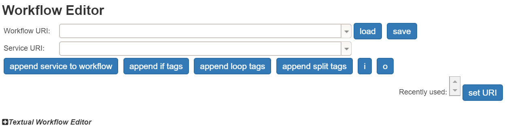

# Advanced workflow creation: Branching and looping

To create more sophisticated workflows, the workflow editor offers branching and loops:

Need to perform a case distinction and execute different services based on the result? Make use of the [branching feature](#branching).

Want to execute a service multiple times? There is no need to manually call it multiple times, make use of the [loops](#loops).


### Condition scheme

Both features support a simple condition scheme, denoted in xml, which enables integer comparisons:

```
<condition>COMMAND(VARIABLE, VALUE)</condition>
```

The COMMAND may one of the following: `greaterThan`, `greaterOrEqual`, `equalTo`, `lessThan`, `lessOrEqual`.
The condition will compare the value of the VARIABLE with VALUE based on the COMMAND.
Here, the variable may by one of the following:

- the ID of an input or output, e.g. ``main_input2`` of the following input: ``<input ID="main_input2" URI="http://DFKI/apps/IFrameDisplay.owl#extraParameters"/>``
- the fragment of a URI, e.g. ``extraParameters`` of the following input: ``<input ID="main_input2" URI="http://DFKI/apps/IFrameDisplay.owl#extraParameters"/>``

Additionally, both features require the use of the __textual editor__ to integrate the services correctly into the modified workflow. To open the textual editor you need to click on the "+" before __Textual Workflow Editor__.




## Branching

Perform a simple case distinction and execute different services depending on the result.

### Steps:


- In the "Workflow Editor"-UI below the "Service URI"-field click on "append if tags" to add the basic syntax to your workflow

```xml
<workflow URI="">
  <output URI="#out1" ID=""/>
  <input URI="#sessionToken" ID="sessionToken"/>
  <input URI="#extraParameters" ID="extraParameters"/>
  
  <services>
    <sequence>

      <if><condition>greaterThan(sessionToken, 5)</condition>
        <!-- allowed commands greaterThan greaterOrEqual equalTo lessThan lessOrEqual -->
         <then>
        <!-- Add the service(s) to be executed if the condition is fulfilled below -->


        </then>
        <else>
        <!-- Add the service(s) to be executed if the condition is not fulfilled below -->


        </else>
      </if>
	  <service URI="http://www.cloudifacturing.eu/sync/DFKI/EndIf.owl#EndIf_Service">
        <input URI="http://www.cloudifacturing.eu/sync/DFKI/EndIf.owl#Else_Out"/>
        <input URI="http://www.cloudifacturing.eu/sync/DFKI/EndIf.owl#Then_Out"/>
        <output ID="s1io2" URI="http://www.cloudifacturing.eu/sync/DFKI/EndIf.owl#ITE_Out"/>
      </service>
    </sequence>
  </services>
</workflow>
```


- Add desired service between `<then>`-tags.
- Add respective service between `<else>`-tags.
- Adapt the condition to your needs.
- Connect ITE_out to your remaining services or the "Workflow Output".

Upon execution the condition will be evaluated. If it is fulfilled the services within the then-case will be executed, otherwise the else-case will be executed. In any case the result of the executed branch will be forwarded to the ITE_out output.

## Loops

If you need to execute a service multiple time, you can make use of the loop feature:

### Steps:


- In the "Workflow Editor"-UI below the "Service URI"-field click on "append loop tags" to add the basic syntax to your workflow.

```xml
<workflow URI="">
  <output URI="#out1" ID=""/>
  <input URI="#sessionToken" ID="sessionToken"/>
  <input URI="#extraParameters" ID="extraParameters"/>
  
  <services>
    <sequence>

      <repeat-until>
        <sequence>
		<!-- Add the service(s) to be executed as long as the condition is fulfilled below -->
		
        </sequence>
        <condition>greaterThan(sessionToken, 5)</condition>
        <!-- allowed commands greaterThan greaterOrEqual equalTo lessThan lessOrEqual -->
      </repeat-until>
    </sequence>
  </services>
</workflow>
```

- Add your service in between the `<repeat-until><sequence>`-tags.
- Adapt the condition to your needs.

Upon execution, your service(s) will be executed at least once before the condition is checked. If the condition is fulfilled, your services will be executed again, before the condition is re-evaluated.