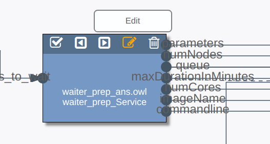

# Upgrading SemWES services
Sometimes, a service which is already deployed and registered on the SemWES
platform has to be upgraded. This article lists things to keep in mind when 
doing such updates.

## Updates without API changes
If an update does not touch the services API, i.e., the number and names of
input and output parameters, no special care has to be taken. SemWES will
continue calling your service just as it has done before.

## Updates introducing new input or output parameters
If an update introduces new input or output parameters to a service, this change
needs to be somehow communicated to the workflow editor such that the new
parameters can be used in new or existing workflows. To do so: 
1. Upgrade the web service itself, so that the wsdl file reflects the changes.
2. Go to the workflow editor and load a workflow which uses your service.
3. Double-click on the service box in the graphical editor and choose "Edit":

  

4. The input fields on the top of the workflow-editor website are filled with
   the service properties. Simply click on "Update service", which will cause
   the platform to read the service's wsdl again and thus receive the updates
   made to the service interface.

Afterwards, the new input and output parameters will be available whenever the
service is used in a workflow. Note that already opened workflows need to be
reloaded in the editor first.

Also note that this procedure is non-destructive. As long as no existing input
or output parameter changes or is removed, workflows using the services won't
have to be touched.

## Updates removing or renaming input parameters
This is dangerous, since any workflow using one of the changed parameters will
inevitably fail after the upgrade. Do this only when you are absolutely clear
about the consequences. Consider to deploy and register a separate version of
the service instead.
