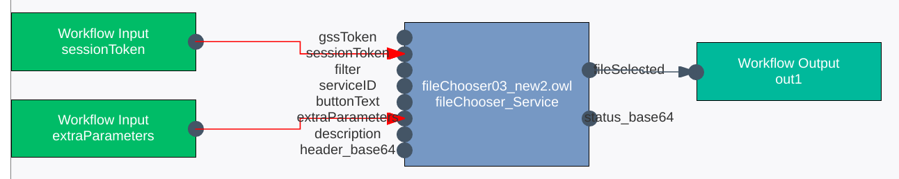
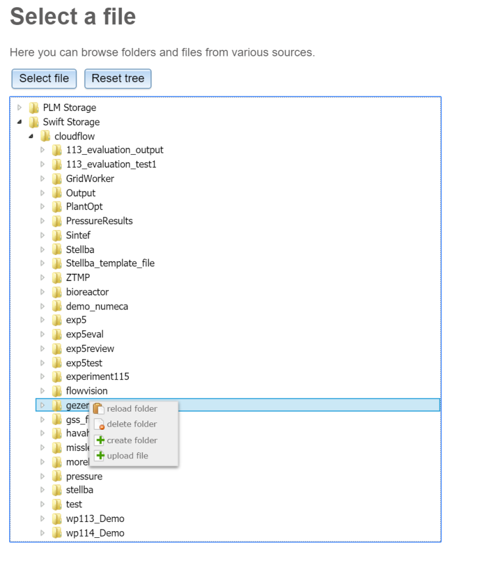

# File selection using the File Chooser service
Workflows in SemWES typically communicate with one of the provided
cloud storages. The interactions towards the files themselves are typically
handled through GSS (Generic Storage Services), but this requires that the
services already know where a file is stored or, alternatively, which folder it
should upload a file inot. In order to provide a user friendly way to pick files
and folders that will be used in a workflow, the File Chooser application has
been developed.

The File Chooser is a web application which is meant to be used as a step in
SemWES workflows, serving as a GUI towards the cloud storage solutions
offered in the project. It also provides a user-friendly and natural way to
obtain unique GSS names which can be used as input to other services later in
the workflow chain.

## Integrating the file chooser in a workflow
The file-chooser service is currently registered under the following URI:
```
http://www.cloudifacturing.eu/apps/sintef/fileChooser.owl#fileChooser_Service
```
Use this URI to add the service to your workflow.

The following screenshots shows the minimal connections you need to make to
the file-chooser service block:
<p align="center">
  
</p>

The complete set of parameters is explained in the following table:

| Parameter name | Wiring required? | Description |
| -------------- | --------- | ----------- |
| `sessionToken` | yes | The session token used for authentication. Should be connected to the workflow input with the same name |
| `serviceID` | no | Provided automatically by the WFM, must be left open. |
| `extraParameters` | yes | Contains parameters such as the GSS location, must be wired to corresponding workflow input. |
| `selectedStorages` | no | Specifies which storages to display in the file chooser. Enter a comma-separated list of identifiers. Available are: `it4i_anselm://`, `it4i_salomon://` |
| `description` | no | base64-encoded informative description to be shown above the buttons in the web GUI. Can use html code and CSS styling. |
| `header_base64` | no | base64-encoded text to be printed above the description in the web GUI. Can use html code and CSS styling. Default is `<h1>Select a file</h1>`|
| `buttonText` | no | Plain-text string (no base64 encoding!) to be used for the "Select file" button. Default is "Select file". |
| `filter`| no | Filter for the tree view in the web GUI. Can be either `"folder"` to display and select only folder, `"folderWithFiles"` to display everything but allow only folder selection, or a semicolon-separated list of accepted file extensions, such as `.stp;.g2` |
| `gssToken` | no | Token different from session token to be used to contact external storages. Currently _not_ in use. |


## The File Chooser user interface
The following image shows a screenshot of the file-chooser web GUI as displayed during workflow execution:
<p align="center">
  
</p>

The top buttons have the following functions:
* **Select file**: Tells WFM to use the marked file as output parameter, and the 
  next step of the workflow is executed. Only files are allowed to be selected 
  unless otherwise specified through the `filter` service parameter (see above).
  The button text can be renamed via the `buttonText` parameter (see above).
* **Reset tree**: Collapes all folders. Their content will be reloaded when 
  opening them again. 
  
The context menu has the following entries for folders:
* **Reload folder**: Triggers a manual reload of the clicked folder. By default,
  if a folder is opened, the content of the first level of subfolders is loaded as
  well. A folder is reloaded automatically if its content is changed by the user 
  (through uploading/deleting/creating files or folders).
* **Delete folder**: Deletes the chosen folder and all its content. Note that this
  can take some time if there are a large number of elements in the folder, and the
  effect might not be immediately shown. (The deletion is processed recusively
  starting with the leaf nodes in the tree.)
* **Create folder**: Creates a new folder in the chosen folder.
* **Upload file**: Uploads a new file to the chosen folder.

The context menu has the following entries for files:
* **Download file**: Downloads the file to the client's computer.
* **Delete file**: Deletes the chosen file.
* **Start workflow**: Starts a new workflow using the chosen file as input. The
  new workflow will be started in a new tab. Whether a workflow is available for a
  certain file depends on the file's extenstion.
  
  _Note:_ Currently, the list of available workflows is maintained manually at SINTEF.
  
### How to integrate a workflow in the file chooser's context menu?
The file chooser allows to start workflows via its context menu for files. To integrate
your workflow in this context menu, first make sure that it expects a file GSS ID as input.
The workflow input needs to be called "fileID". This input name can be added to the xml
text in the textual workflow editor:
```
<input ID="main_input2" URI="http://company/workflows/postProc_fc.owl#fileID"/>
```
Once this is in place, contact Robert from SINTEF with
* the URI of the workflow to start,
* the file extension to be eligible for the workflow.
